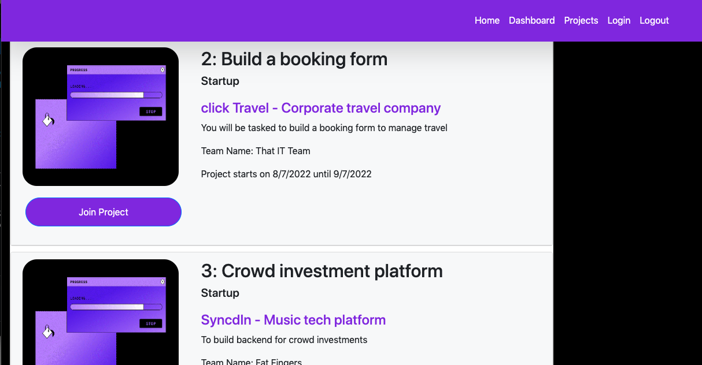
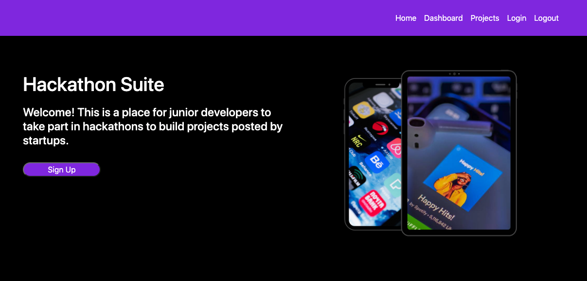
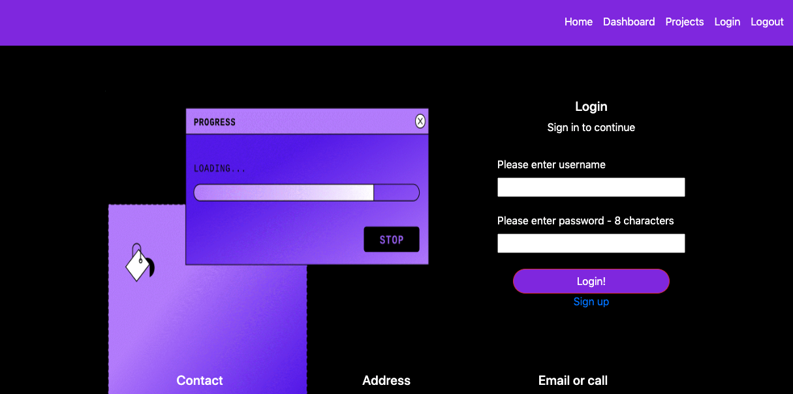

# THE HACKATHON SUITE – by Jarfa Tech

## Description

Where junior developers can join a hackathon app. A start up code is already on the page and when a user joins a project it will generate a team name. A junior dev must create an account to sign in before they can join a project, and other juniors can also join the project

## User Story

`As a user, I would like login, find a suitable project and join a team of junior developers to work on that project.`

## Acceptance Criteria

`I am becoming a member of a junior developer hackathon platform
WHEN I sign up
THEN i am presented with a login page with the option to login or signup.
WHEN the signup page is displayed
THEN I am presented an input field with email, username, password and bio.

WHEN I have logged in
THEN I am presented with my dashboard with my username displayed.

WHEN I am signed in
THEN I have the option to navigate to the projects page to view all the projects that have been made available by startups to join.

When I am on the projects page
Then I am given the option to join a project

When I have joined a project, it either has a team formed to join with a team name generated or if I am the first to join have the team name generated when I click join`

## Technologies Used

Technologies
The following technologies was used
bootstrap
Mysql2
Sequelize
Express / express-session / express-handlebars
Bcrypt
Connect-sessions-sequelize
Dotenv
Superhereos

## Links to repository and deployed app

Github - https://github.com/Farhiya1/Project2
Deployed page - https://salty-woodland-88670.herokuapp.com/

## Github repositories

1. https://github.com/jtiwana-git
2. https://github.com/misscbrown
3. https://github.com/Farhiya1

## Screenshots of deployed application

## References

1. https://www.npmjs.com
2. https://www.w3schools.com/nodejs/nodejs_filesystem.asp
3. https://www.freecodecamp.org/news/how-to-write-a-good-readme-file/
4. https://www.npmjs.com/package/mysql2
5. https://www.npmjs.com/package/sequelize
6. https://www.npmjs.com/package/dotenv
7. https://www.w3schools.com/js/js_api_fetch.asp
8. https://developer.mozilla.org/en-US/docs/Web/JavaScript/Reference/Statements/for-await...of
9. https://handlebarsjs.com/guide/partials.html#partial-parameters
10. https://www.tabnine.com/code/javascript/functions/bcrypt-nodejs/compareSync
11. https://developer.mozilla.org/en-US/docs/Web/API/Web_Authentication_API
12. http://expressjs.com/en/resources/middleware/session.html
13. https://handlebarsjs.com/guide/
14. https://www.npmjs.com/package/express
